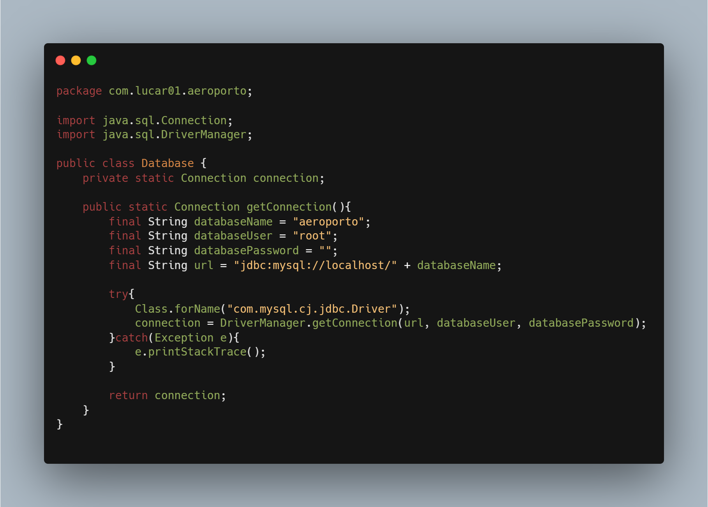

## Aeroporto

Progetto di Basi di Dati per l'università _Alma Mater Studiorum di Bologna_.
Il progetto verte sulla progettazione di una base di dati riguardante una infrastruttura aeroportuale.

## Installation

- Run _aeroportoDbCreation.sql_ on **MySQL Workbench**.
- Run _aeroportoDbData.sql_ on **MySQL Workbench**.
- If they don't work, modify the _charset_ and _collate_.

## Configuration Options
- Update the _Database.java_ file in the `src/main/java/com/lucar01/` directory, you can modify:
- `databaseUser`
- `databasePassword`

<!--  -->

## Usage

- Run _Main.java_ in the `src/main/java/com/lucar01/` directory.
